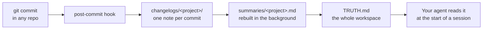
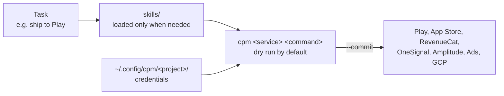

# CPM (Cross-Project Memory)

CPM gives your coding agent a memory across repos, and a toolkit for the app store,
billing and push services a mobile app runs on.

## What it is

- **Memory.** A git `post-commit` hook writes a short note for every commit. The
  notes roll up into one summary per project and a single `TRUTH.md` for the whole
  workspace. Your agent reads `TRUTH.md` at the start of a session and already
  knows where things stand.
- **Toolkit.** One command, `cpm`, for Google Play, App Store Connect, RevenueCat,
  OneSignal, Amplitude, Google Ads and Google Cloud. Every write is a dry run until
  you add `--commit`.
- **Skills.** Short guides the agent loads only when a task needs them, one per
  service. Works with Claude Code, Codex, Cursor, Gemini CLI, GitHub Copilot or
  any other coding agent.

## How it is made

Bash scripts, git hooks and Markdown files for the memory. Python (standard library
where possible) for the toolkit. No server, no database, no account. Everything is
plain files in your own workspace. Credentials stay in `~/.config/cpm/<project>/`,
never in a repo.

## How it works

**Memory: every commit becomes something your agent can read.**



**Toolkit: the agent picks a skill, the skill runs a `cpm` command.**



And when you work something out by hand, the `cpm-learn` skill turns it into a new
skill, so the next time is one command.

## Install

```bash
curl -fsSL https://raw.githubusercontent.com/tirupati17/cpm/main/install.sh | bash
```

Or clone it into the folder that holds your repos and run `./setup.sh`. Then:

```bash
./scripts/install-hooks.sh    # add the post-commit hook to every repo
./scripts/backfill.sh         # optional: build notes from existing history
./scripts/cpm-check.sh        # health check and a short briefing
```

## Works with any coding agent

CPM only writes files and runs shell commands, so it doesn't depend on any one
agent. `setup.sh` writes the instructions to `AGENTS.md`, the file most agents
already read, and points the others at it:

| Agent | Reads instructions from | Skills |
|---|---|---|
| Codex, Cursor, GitHub Copilot, and others that read `AGENTS.md` | `AGENTS.md` | `.agents/skills/` or `skills/INDEX.md` |
| Claude Code | `CLAUDE.md`, a one-line `@AGENTS.md` pointer | `.claude/skills/` |
| Gemini CLI | `GEMINI.md`, a one-line `@AGENTS.md` pointer | `skills/INDEX.md` |
| Aider | `aider --read AGENTS.md` | `skills/INDEX.md` |
| Anything else | tell it to read `AGENTS.md` | `skills/INDEX.md` |

`skills/INDEX.md` lists every skill in one line with when to use it, so an agent
without skill support can still find and open the right `SKILL.md`. To link skills
into another folder, set `CPM_SKILL_DIRS` (for example
`CPM_SKILL_DIRS=".agents/skills .my-agent/skills"`).

Already have your own instructions file? Add this to it:

```markdown
At the start of every session, run ./scripts/cpm-check.sh, then read TRUTH.md
and memory/summaries/<project>.md. For store, billing, push, ads or cloud work,
read skills/INDEX.md and follow the matching SKILL.md.
```

The optional review bot in `claude-review-bot/` is the one part tied to a
single provider: it is a GitHub Action that calls the Claude API.

More detail: [`toolkit/README.md`](toolkit/README.md), [`skills/README.md`](skills/README.md).

## Built with CPM

- [Emotica](https://emotica.me): emotional wellness app for iOS, Android and web.
- [Aastroastra](https://www.aastroastra.com): AI Vedic astrology app.

## Who makes it

CPM is built and maintained by Tirupati Balan, currently its only contributor. I use
it every day to build and ship my own mobile products, and I made it open source so
other developers can use it too. Issues and pull requests are welcome.

## Licence

MIT. See [LICENSE](LICENSE).
